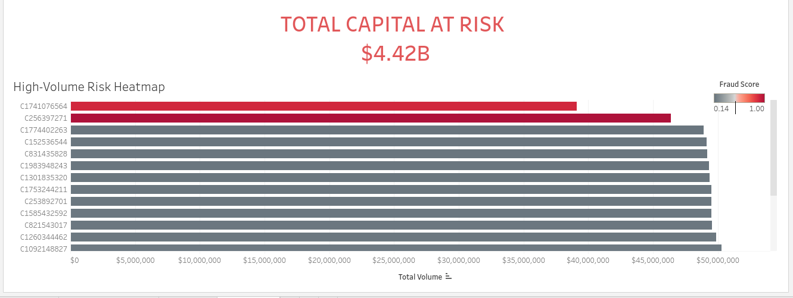

# Project Aegis: Strategic Financial Fraud Detection

### 📊 [View the Live Executive Dashboard Here](https://public.tableau.com/shared/S8F5DCXW2?:display_count=n&:origin=viz_share_link)

**Analyst:** Jen Jones
**Tools Used:** Google BigQuery (SQL), R-Studio (Statistical Modeling), Tableau (Visualization)

---

### 🔍 Executive Summary
Project Aegis is a multi-stage technical framework designed to identify "High-Volume Outliers"—transactions that exceed institutional risk thresholds ($40M+) but bypass standard automated flags. By combining behavioral SQL analysis with statistical probability modeling, this project isolates critical financial threats for immediate investigative review.

### 🛠️ Technical Architecture

#### Phase 1: Data Engineering (SQL)
* **Objective:** To structure raw transaction logs into an analyzable behavioral dataset.
* **Key Logic:** Engineered features including `transaction_velocity`, `regional_volume_spikes`, and `ledger_integrity_checks` to detect "Shadow Ledger" discrepancies.

#### Phase 2: Statistical Risk Modeling (R)
* **Objective:** To quantify the probability of fraud using weighted logistical factors.
* **Methodology:** Applied a logarithmic scale (`log10`) to normalize "Whale" transactions and calculated a `fraud_probability` score (0.0 - 1.0) based on volume-to-velocity ratios.

#### Phase 3: Risk Visualization (Tableau)
* **Objective:** To reduce "Time-to-Decision" for compliance officers.
* **Outcome:** Created a "Red-Black" diverging heatmap that prioritizes the top 20 risk targets, providing an instant view of the $4.4B total capital exposure.

---

### 📂 Repository Contents
* `Aegis_SQL_Logic.sql`: The extraction and feature engineering script.
* `Aegis_Risk_Model.R`: The statistical probability scoring script.
